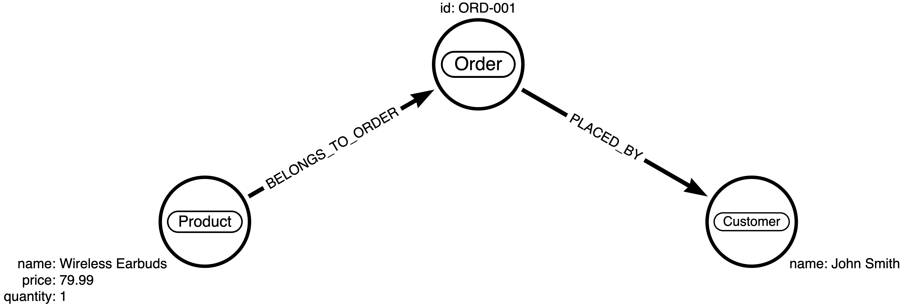

# csv-to-knowledge-graph

<p align=center>
  
  
</p>

<div align=center>
  <h3>Create Dgraph backed knowledge graphs from CSV files. </h3>

  <p>Built with <a href="https://hypermode.com/">Hypermode</a> and powered by AI.</p>

  <p> 👉
    <a href="https://csv-to-knowledge-graph-frontend.vercel.app">Import my CSV now!</a>
  </p>
</div>

## Table of Contents

- [csv-to-knowledge-graph](#csv-to-knowledge-graph)
  - [Table of Contents](#table-of-contents)
  - [Features](#features)
  - [Introduction](#introduction)
    - [What problem does this solve?](#what-problem-does-this-solve)
    - [How does it work?](#how-does-it-work)
  - [Under the Hood](#under-the-hood)
    - [AI-Powered Analysis](#ai-powered-analysis)
    - [RDF Generation](#rdf-generation)
    - [Query Generation](#query-generation)
    - [CSV-to-RDF Library](#csv-to-rdf-library)
    - [RDF-to-Dgraph Library](#rdf-to-dgraph-library)
  - [Usage](#usage)
  - [Powered by Hypermode](#powered-by-hypermode)

> Looking to contribute? Check out the [Contributing Guide](docs/CONTRIBUTING.md) for more information on how to get started with development.

## Features

- 🚀 **Browser-Based CSV Processing** - Upload CSV files directly in your browser.

- 🧠 **AI-Powered Graph Generation** - Auto-detect entities and relationships from CSV columns.

- 🔍 **Interactive Graph Visualization** - Zoom, pan, and reposition nodes in your knowledge graph.

- 🔄 **RDF Template Generation** - Create RDF templates from your graph structure.

- 📝 **RDF Data Conversion** - Transform CSV to RDF with real-time progress tracking.

- 🔌 **Dgraph Integration** - Connect, test, and import data to your Dgraph instance.

- 💡 **DQL Query Generation** - Get auto-generated queries specific to your schema.

- 🔗 **Ratel Support** - Open queries in Dgraph's Ratel UI with one click.

- 🧩 **Modular Architecture** - Separate packages for CSV-to-RDF, RDF-to-Dgraph, and graph handling.

## Introduction

### What problem does this solve?

Getting data into Dgraph is unnecessarily complicated. Currently, you need to:

- Manually create schema files that correctly model your data
- Learn RDF (Resource Description Framework) format and its quirks
- Run complicated command-line tools with cryptic options
- Write custom scripts to transform your data that often break

This creates a steep learning curve that prevents many organizations from using graph databases effectively. CSV to Knowledge Graph removes these barriers by providing a simple, visual way to transform regular CSV files into graph data.

### How does it work?

1. **Upload your CSV**: Simply drag and drop your CSV file into the browser
2. **AI analyzes your data**: Our AI examines your column names to automatically identify entities and relationships
3. **Visual graph preview**: See and interact with the proposed knowledge graph structure
4. **Generate RDF**: Convert your CSV data to the RDF format Dgraph requires
5. **One-click import**: Connect to your Dgraph instance and import with a single click

Here's a simple example of how a CSV file:

```sh
Order_ID,Customer_Name,Product_Name,Quantity,Price
ORD-001,John Smith,Wireless Earbuds,1,79.99
ORD-002,Sarah Johnson,Smart Watch,1,249.99
```

Gets transformed into RDF triples:

```sh
<_:Customer_John_Smith> <dgraph.type> "Customer" .
<_:Customer_John_Smith> <Customer.name> "John Smith" .

<_:Order_ORD-001> <dgraph.type> "Order" .
<_:Order_ORD-001> <Order.id> "ORD-001" .
<_:Order_ORD-001> <PLACED_BY> <_:Customer_John_Smith> .

<_:Product_Wireless_Earbuds> <dgraph.type> "Product" .
<_:Product_Wireless_Earbuds> <Product.name> "Wireless Earbuds" .
<_:Product_Wireless_Earbuds> <Product.price> "79.99" .
<_:Product_Wireless_Earbuds> <Product.quantity> "1" .

<_:Product_Wireless_Earbuds> <BELONGS_TO_ORDER> <_:Order_ORD-001> .
```

<p align=center style="margin-top: 20px; margin-bottom: 20px;">
  
</p>

## Under the Hood

### AI-Powered Analysis

Our AI analyzes your CSV column names to intelligently identify entities, attributes, and potential relationships. It recognizes patterns like `Customer_Name` or `Order_ID` to generate a coherent graph structure that represents the real-world relationships in your data.

This analysis happens entirely in your browser. The AI examines column naming patterns, value types, and contextual relationships to build a comprehensive graph model that serves as the foundation for RDF generation.

### RDF Generation

The RDF generation pipeline automatically creates a template that maps CSV data to a valid RDF format compatible with Dgraph. This includes:

- Generating appropriate entity types based on column groupings
- Creating unambiguous relationship predicates with proper direction
- Defining attribute mappings between CSV columns and RDF properties
- Setting correct data types for each attribute

The template is then applied to your CSV data, converting each row into a set of RDF triples that preserve the semantic structure of your information.

### Query Generation

Once your data is imported, the application automatically generates useful Dgraph Query Language (DQL) queries customized to your specific data model. These queries are designed to:

- Showcase common query patterns for your specific entity types
- Demonstrate traversal across relationships in your knowledge graph
- Include appropriate filters and aggregations based on your data structure

Each query can be immediately executed or opened in Dgraph's Ratel UI for further exploration and modification.

### CSV-to-RDF Library

The `csv-to-rdf` library processes CSV files entirely in the browser, using a template-based approach to transform tabular data into RDF triples. It features:

- Memory-efficient chunking to handle large CSV files without browser crashes
- Real-time progress tracking ideal for responsive UI feedback
- Template-based transformation that replaces column placeholders with actual values
- Support for complex entity relationships and data type conversions
- Streaming processing with minimal memory footprint

### RDF-to-Dgraph Library

The `rdf-to-dgraph` library enables direct browser-to-Dgraph communication without requiring a backend server:

- Uses standard browser fetch APIs to connect directly to Dgraph's HTTP endpoints
- Handles authentication, schema setup, and data import through a browser-compatible interface
- Provides detailed import statistics and progress tracking
- Automatically sets up appropriate relationship directives in the schema
- Works around browser limitations by breaking large mutations into manageable chunks
- Fetches current schema information and node type counts for query generation

## Usage

👉 [Import my CSV now!](https://csv-to-knowledge-graph-frontend.vercel.app)

## Powered by Hypermode

Built with ❤️ by [Hypermode](https://hypermode.com/).
